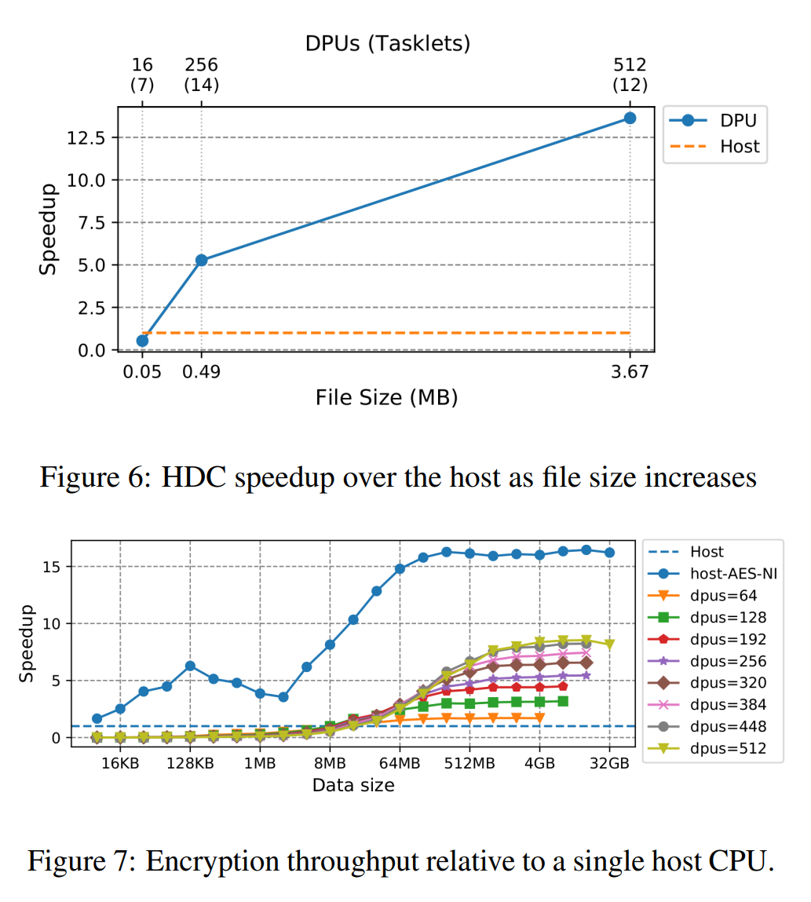

# A Case Study of Processing-in-Memory in off-the-Shelf Systems

### Abstract

本文作者来自于UPMEM SAS公司和不列颠哥伦比亚大学。本文主要评估了一个PIM体系结构，通过五项实验证明了PIM的计算能力。

### 1 Introduction

(1)背景：冯·诺依曼瓶颈是发生在CPU通过一个有限的通道连接到主存的系统中，限制了带宽并拉长了数据访问的延迟。

(2)优势：本文评估的硬件是专门为替代传统DRAM而设计的，这带来了许多模拟体系结构中不存在的一些限制。

(3)硬件介绍：UPMEM的DRAM内存包括通用处理器，称为DRAM处理单元(DPU)[5]。每个64MB的DRAM片都有一个专用的DPU，因此计算资源随内存的大小而扩展。

(4)本文主要研究内容：利用硬件的优势，本文移植了五个计算需求随着数据大小变化且需要高内存带宽的应用程序。通过研究发现应用程序吞吐量随数据大小而扩展，但扩展并不总是该硬件所能达到的最佳状态。主要原因是在不复制的情况下，很难从主机CPU访问位于具有dpu的DRAM中的数据、dpu处理能力有限以及dpu控制的粒度。

(5)本文总结：本文的主要贡献是理解了当PIM集成到现成系统中时的局限性。

###  2 Architecture

现有PIM体系结构众多，位置不同。我们从COMPUTE-OUT-MEMORY-NEAR(COM-N)模型研究特定的硬件。该模型包括位于存储器阵列外部但在存储器包内部(相同或不同的硅模)的计算逻辑，也被称为PIM。在本研究结束后，三星宣布生产类似的PIM硬件(FIMDRAM)，也属于COM-N型号[15]。虽然无法进行深入的比较，但公布的设计有明显相似之处。本研究会适用于以后的PIM研究。

**Organization** 在本文研究的体系结构中，DRAM被组织成ranks(每个DIMM有两个ranks)，每个ranks包含8个内存芯片。每个DRAM芯片包括8个DRAM Processing unit (dpu)。每个DPU都附带一个64MB的DRAM片。每个级别有64个dpu，每个8GB内存内存有128个dpu。

**DPU Capabilities.** DPU是一种简单的通用处理器。UPMEM的设计只支持**整数**运算(不支持浮点硬件)。每个DPU在私有总线上独占地访问它的DRAM片。总DRAM越多，dpu就越多。每增加一个内存单元，计算能力和内存条带宽都随着内存的大小而增加。图1为单个DPU及其外围的示意图。DPU在对数据进行计算之前将数据从DRAM复制到一个64KB的私有SRAM缓冲区，称为**工作内存**。复制通过一个显式的、阻塞的DMA指令执行。DMA引擎可以在单个操作中复制高达2KB的数据，但复制时间随数据大小线性增加。为了隐藏DMA延迟，每个DPU有24个硬件线程，称为tasklet，可以被调度为同时执行。因为它是一种交错多线程(interleaved multithreading, IMT)设计[31] (多线程时间片)，每个周期只能推进一个tasklet。当一个tasklet在DMA操作上被阻塞时，其他tasklet仍然可以继续进行。

**DPU Speed.** dpu的处理能力远低于普通主机CPU。dpu具有简单、有序的设计，时钟频率从266MHz(在我们的实验系统中)到500MHz(预计在商业产品中)。这对于适应商品系统的功率范围是必要的。

**DPU communication.** DPU间没有通信线路，无法进行DPU-to-DPU通信，所以运行在dpu上的程序必须在执行前**将数据分片**，并使用**不需要数据共享的算法**。

**Interleaving.** 在芯片级别上，交织规定了字节的顺序，因为它们被写入DRAM。在测试系统的内存中，每个DRAM芯片通过一个8位接口与DDR4总线连接。8个芯片一起构成64位宽总线。当64字节缓存线提交到内存时，数据以字节粒度在DRAM芯片之间交叉，第一个字节进入芯片0，第二个字节进入芯片1，以此类推。所以当写入完成时，第一个芯片接收字节0,8,16，…56。在这个级别上，通过同时激活多个芯片来隐藏读写延迟。交错对宿主是透明的，因为数据会在两个方向上适当地重新排序(即在读写期间)。但是，DPU只能访问自己的slice中的数据，只能看到写入到特定芯片的内容(即数据的每n字节)。这个属性使得位于同一位置的主机CPU和DPU很难访问数据。除非运行在DPU上的程序可以修改为对非连续数据进行操作，否则我们必须创建一个单独的副本，在此过程中进行转置，以便每个DPU接收到连续的数据部分。

**Transposition.** UPMEM的SDK通过转置数据来抵消交织。虽然转置的成本很小(当前SDK提供了一个使用SIMD扩展的高效实现)，但需要经过DRAM总线的数据拷贝的成本却很大。对于可以将数据放在DPU内存中并仅使用DPU在其上计算的应用程序，一次性复制的成本可以忽略不计，但对于数据寿命较短或DPU和主机CPU都必须访问数据的应用程序，频繁复制将对内存通道造成压力——这正是该架构旨在避免的瓶颈。

**Control granularity.** 主机只能以rank为单位控制DPU，如果某rank中的任何DPU正在执行，那么主机就无法访问该rank中的任何内存。在实践中，这导致将配备dpu的内存视为加速器，而不是主RAM的一部分。主机通常将程序和数据保存在“普通”DRAM(即主机DRAM)中，将用于处理的数据复制到DPU DRAM中，并将结果复制回来。更细粒度的执行组可能会提高像grep这样“流化”数据的算法的性能。

###  3 Evaluation

#### 3.1 Workloads

考虑到DPU架构的特性，我们选择了随着数据规模的增加而需要更多计算资源的程序，这些程序可以很容易地并行化，并且数据共享最小。

DPU架构的SDK包括一个C编译器和一些库，这些库具有加载和启动DPU、复制和转置数据等功能。虽然我们可以用熟悉的语言编写代码，但主要的挑战与内存管理有关(因为DPU需要在处理数据之前将数据从DRAM复制到工作内存中)，以及有效地控制DPU的数量。

**Snappy.** Snappy是一种轻量级的压缩算法。Snappy将原始文件分成固定大小的块(通常为64KB)，并对每个块进行单独压缩。最初的实现是为顺序(即单线程)处理设计的。文件格式将压缩块首尾相连，没有任何分隔标记。结果是，要解压缩块n，程序必须首先解压缩块0。n−1。为了启用并行，我们改变了压缩文件的格式，在每个块的前面加上了其压缩大小。这个小改动使宿主程序能够快速定位每个压缩块的开始位置，而无需解压缩前面的块。我们还通过添加解压后的块大小修改了header。这使我们能够试验不同的块大小。Snappy是带宽密集型的，因为它的处理量很小，尤其是在解压过程中。大部分时间都花在复制字符串字面量或之前解码的字符串上。

**Hyperdimensional computing.** 超维计算(HDC)[13]在人工智能中用于模拟大量神经元的行为。它依赖于具有高维数(至少10 000维)的向量，称为超向量，来对数据进行分类和查找模式。我们的HDC应用程序将原始肌电图(EMG)信号分类为特定手势[25]。我们建立在先前的参考实现[20]之上。分类是通过计算之前编码的输入超向量和之前训练的向量之间的汉明距离来进行的。我们的实现将原始信号数据分布在dpu中，然后将其编码为超向量并进行分类。

**AES Encryption.** 高级加密标准(AES)是一种对称密钥算法，具有高度的安全性，可以在各种硬件上高效运行。使用OpenSSL[26]中Rijmen、Bosselaers和Barreto实现的AES-128进行分析。加密是一个理想问题;数据可以被分割成小的独立块，算法可以并行操作，数据访问模式使得优化DMA传输变得简单。AES可以在多种模式下运行。我们使用ECB (electronic code book)模式，确保每个块都可以单独处理，而不依赖于其他块。

**JSON filtering.** JSON是一种灵活且可读的存储和交换数据的格式。由于它的ASCII表示，解析是出了名的慢[17,19,29]。当分析系统过滤JSON中的记录时，它们会解析每一条记录并检查过滤条件。对所有记录执行解析，即使是那些不满足过滤条件的记录。相反，更稀疏的[24]表明，在解析记录之前，通过在原始的(未解析的)JSON上运行字符串比较，更好地过滤记录。原始滤波是高度并行和内存密集型的[9]，因此在我们的研究中很有前途。我们修改了稀疏的[23]，将原始过滤卸载到dpu，而主机执行其余的解析。

**Grep**  Grep[1]是一个命令行实用程序，用于在纯文本中搜索匹配正则表达式的行。我们实现了grep的一个子集，它只搜索精确的文本匹配。我们的设计在工作池中使用dpu，通过小批量地准备文件，并在足够多的dpu准备好执行工作时立即开始搜索。

为了解决需要在大型group中控制dpu的挑战，我们平衡了rank中所有dpu的工作，最小化了最快的DPU和最慢的DPU之间的运行时间差异，从而最小化了等待较慢DPU的空闲时间。在主机上准备工作消耗了大量的时间，因此快速准备文件比有效地将它们打包到dpu中更重要。为了在限定的时间内尽可能均匀地填充rank，文件按照它们在输入中出现的顺序轮转分配给dpu。我们没有花时间按大小对文件进行排序，甚至限制单个DPU可以处理的文件数量，以节省准备过程中的时间。根据经验，最多256个文件可以达到最好的效果。

我们的性能比较基准是单主机CPU，因为我们的重点是了解DPU架构何时克服了冯·诺依曼瓶颈，何时没有。

#### 3.2 Memory bandwidth scaling

在DPU体系结构中，DRAM的每个额外的片随着工作存储器和DMA通道得到它自己的DPU。这就是它的主要优势:随着内存的大小，可以扩展计算能力和内存条带宽（因为随着扩展，dpu数量增多，能力不断被拓展）。为了演示，我们运行了一个简单的程序，其中所有dpu都会遍历DRAM中的数据，将每个字节从各自的DRAM切片复制到工作内存中。如图2所示，数据处理带宽随着数据大小的增加而增加，对于36GB容量的DRAM(每个DPU约为350MB/s)，数据处理带宽约为200GB/s。对于一个具有128GB DRAM和时钟频率为500MHz的dpu(这是商业发布的目标)的系统，所有dpu达到的总带宽将达到2TB/s。

对于计算和带宽需求随着数据规模增长而增长的应用程序，计算和带宽资源与内存的扩展对性能有直接和积极的影响。图3显示了随着文件大小(以及共享工作的dpu数量)的增加，Snappy压缩的吞吐量。我们对每个文件大小使用最佳的dpu数量——即使用更多的dpu不会产生额外的加速。输入数据驻留在主机DRAM中;实验将数据复制到DPU DRAM，分配并启动DPU运行压缩，并将压缩后的数据复制回主机DRAM。随着文件大小的增长，吞吐量也在增长——这是计算能力和内部带宽随额外内存扩展的直接结果。

分解运行时，我们观察到即使我们增加文件大小，dpu上的执行时间(运行在图4中)仍然大致保持不变，因为更多的dpu在做这项工作。同样，这是根据数据大小扩展计算资源的影响。对于512MB和1GB的文件大小，DPU的执行时间确实会增加，因为当我们达到实验硬件的极限时，每个DPU都会获得更多的数据来处理。图4中的不可扩展的运行时组件，复制、复制和设置，在§3.3中进行了讨论。

最后一个实验是与GPU进行比较，GPU与dpu有相似之处(大规模并行，高内存带宽)，但不具备用内存扩展计算资源的特性。图5显示了随着文件大小的增长，snappy压缩相对于主机CPU的吞吐量(与DPU实验相同)。与DPU架构相反，GPU的扩展是平坦的，吞吐量没有超过主机CPU的5倍。这与GPU的内部内存带宽相吻合，比CPU高大约5倍。

每个DPU都有一个专用的工作内存和一个DMA通道，SM (streaming multiprocessor，流多处理器)内的所有GPU核心共享L1缓存。这种具有随机访问模式的数据密集型工作负载会导致小的64KB L1缓存出现抖动。内存获取成为瓶颈，因此，我们通过启动内核来获得最佳性能，内核由每个计算块一个线程组成(因此每个SM一个线程)，以减少对缓存的竞争。因为输入文件正好在GPU内存中，所以一旦处理开始，就不会通过PCIe总线进行读取。换句话说，GPU成为了冯·诺依曼瓶颈的一个变种的受害者。在内存带宽不是主要限制的工作负载中，由于执行引擎功能较弱，dpu无法达到GPU的吞吐量——这是我们在§3.4中讨论的限制。

#### 3.3 Data copy

正如我们在§2中所讨论的，dpu对数据的反交错(转置)需求意味着，当数据需要同时被dpu和主机cpu访问时，很难避免进行复制。对于可以专门使用DPU的应用程序，数据可以只复制一次到DPU内存，并在运行时的其余时间驻留在那里，使复制开销可以忽略不计。在数据是临时的或者必须由主机CPU和dpu同时访问的程序中，频繁的复制将受到内存通道的限制——这正是PIM要解决的冯·诺依曼瓶颈。

上一节给出的压缩运行时分解(图4)说明了这一点。随着数据大小的增加，DPU的执行时间大致保持不变，因为每个DPU都有一个用于其DRAM切片的专用DMA通道。相比之下，将输入数据复制到DPU内存并将输出复制回来的时间随着文件大小的增加而增加，并受到DRAM通道的限制。

压缩中的设置开销是不可扩展的，因为分割工作需要对输入文件进行顺序解析。这是工作负载和实现的属性，不是架构的基础。另一方面，复制开销是系统的基础，也是图3中压缩吞吐量随dpu数量增加呈亚线性增长的原因。

与Snappy相比，HDC受复制开销的影响较小，而且由于数据集较小，复制开销可以忽略不计。总的来说，复制占用了总运行时间的10%，因此HDC具有更好的可伸缩性，如图6所示。HDC和其他AI应用程序，其中DPU可以对驻留在DPU内存中的长期数据重复执行推理，因此可以很好地避开内存通道瓶颈。

#### 3.4 DPU Speed

当DPU处理能力成为限制时，加密提供了一个很好的例子。图7显示了随着数据量的增加，相对于单个主机CPU的加密吞吐量(每秒字节数)。为了强调处理能力的重要性，我们为每个dpu数量显示了一条单独的曲线。Snappy和HDC对于较小的数据集都需要更少的dpu，而对于较大的数据集则需要更多的dpu，但是计算密集型加密算法喜欢我们能够聚集的最高数量的dpu，无论数据大小。此外，在具有AES-NI[4]加速的主机上的优越性能证实了通用dpu无法与专用指令集竞争。

与其他可用加速器相比，DPU处理能力不太令人印象深刻的另一个例子是snappy解压缩(为简洁起见，图中省略了)。在DPU上，此工作负载的执行与压缩非常相似。在GPU上，与压缩相比，L1缓存不是瓶颈:解压缩可以在较小的输入块大小下工作，并且主要是写密集型的。实验结果表明，GPU表现出与DPU相似的扩展趋势，其性能最高可达24倍，而DPU的优势最高可达8倍。

#### 3.5 Communication and control granularity

由于遵从DDR接口和当前SDK的软件限制，一次控制一个DPU是低效的:只要排名中的一个DPU忙，其他所有DPU都是不可访问的。这意味着程序必须决定如何在一个排序的dpu之间划分数据，并一次性将它们全部启动。虽然对于令人尴尬的并行工作负载来说，这是一个微不足道的决定，但其他工作负载可能因此没有充分利用硬件。dpu无法相互沟通和窃取工作的事实使情况变得更糟。我们使用grep的经验证明了这些挑战。

图8显示了在875MB Linux源代码树上执行不同级别的grep相对于单个主机CPU的吞吐量。相对于主机的吞吐量增益并不大，使用两个以上的级别(128 dpu)没有任何优势。原因是在发布前很难在dpu之间平均分配工作。输入源文件的大小各不相同，即使将它们组织到每个DPU大小相同的桶中，也不能保证所有DPU上的处理时间保持相似。因此，grep使用硬件的效率很低:在最快和最慢的dpu上执行时间的比率是116倍，这表明存在拖后腿者，影响了整个排名。相比之下，JSON过滤，一种与grep非常相似但很容易平均分配工作的工作负载，具有最快/最慢的执行比率为1(没有掉线)和与其他工作负载相似的扩展属性(为简洁起见，图中略去)。

#### 3.6 System cost

最后对系统开销进行了分析，结果表明对于带宽要求较高的应用，使用DPU内存的系统比不使用DPU内存的系统更便宜。

### 4 Conclusion

访存受限的应用程序受限于传统的存储层次结构，增加cpu数量并不能显著提高性能。我们展示了几个真实世界的应用程序，它们可以通过扩展计算资源的内存带宽来加速PIM。PIM与其他加速器共享许多属性(例如大规模并行性)，但内存中处理单元的分布使其在某些情况下具有独特的优势。我们评估的架构有一些限制，阻碍了充分利用硬件的功能，这仍然是未来设计的挑战。为了在主机CPU和PIM内存之间共享数据，必须进行昂贵的数据传输，这大大增加了处理时间的开销，但可以通过就地重用数据来缓解。尽管有局限性，但通过随着数据集的大小扩展处理能力，PIM在应用于正确的问题类别时可以是有效的。
